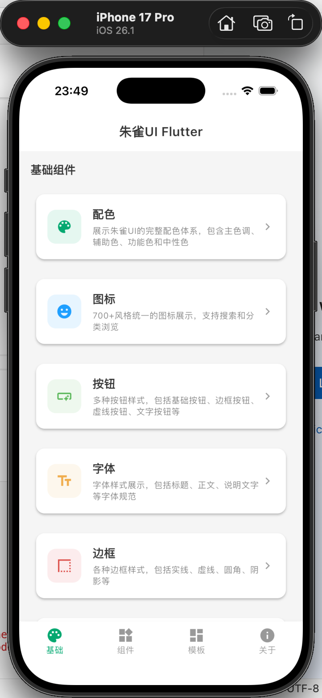
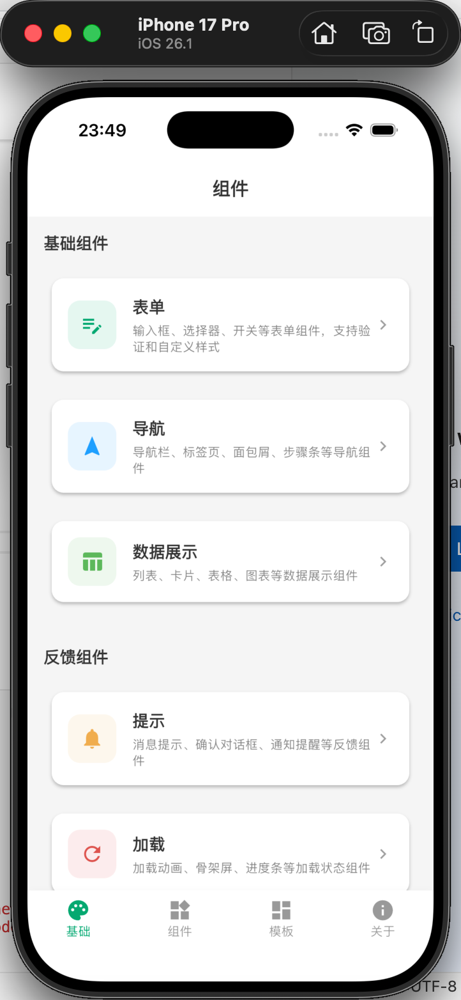
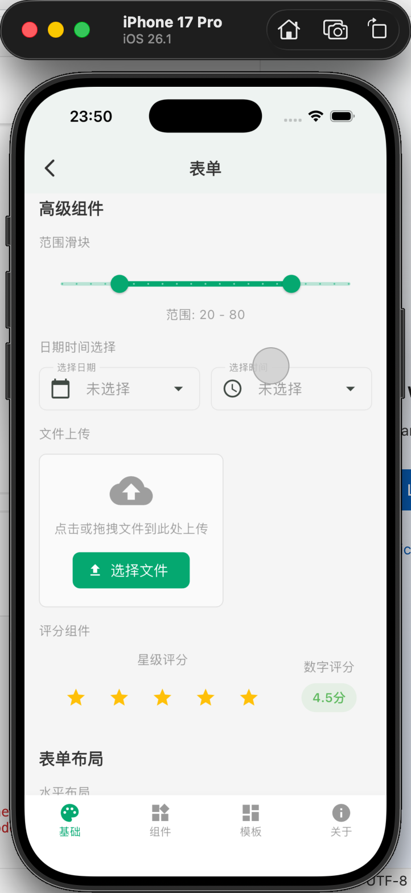
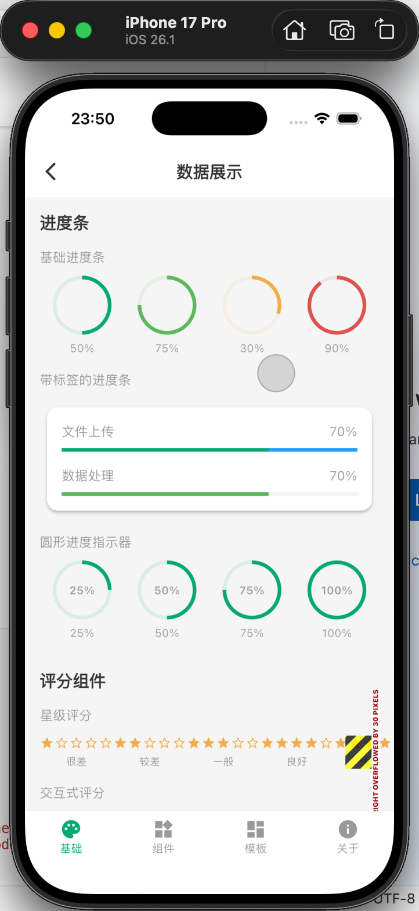
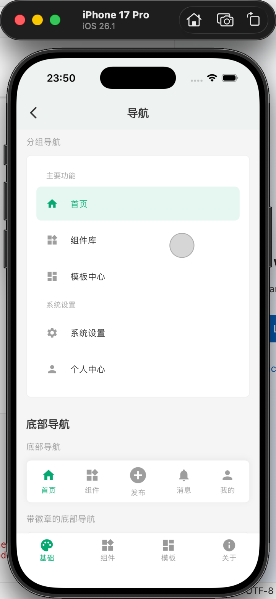
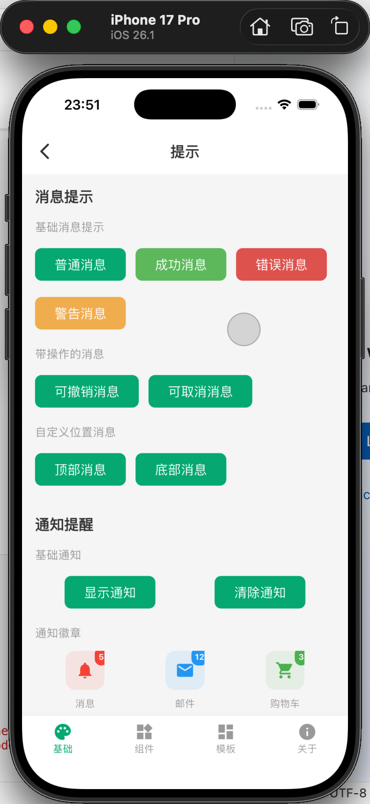
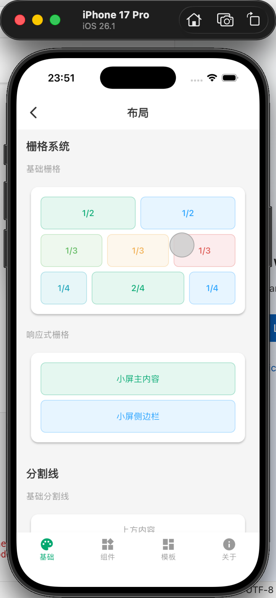

# 朱雀UI Flutter (ZhuQue UI Flutter)

[](https://flutter.dev)
[](https://dart.dev)
[](LICENSE)

## 🌟 项目简介 (Project Overview)

朱雀UI Flutter 是一个基于腾讯TDesign Flutter组件库的现代移动应用演示项目。项目展示了如何使用Flutter构建美观、响应式的用户界面，并集成了状态管理、路由管理和屏幕适配等最佳实践。
扫码加入微信群聊：


关注关注我的微信公众号进行交流。

ZhuQue UI Flutter is a modern mobile application demo project based on Tencent TDesign Flutter component library. The project demonstrates how to build beautiful, responsive user interfaces with Flutter, integrating best practices for state management, routing, and screen adaptation.

## ✨ 特性 (Features)

- 🎨 **现代UI设计** - 基于腾讯TDesign Flutter组件库
- 📱 **响应式布局** - 支持多种屏幕尺寸适配
- 🔄 **状态管理** - 使用Riverpod进行状态管理
- 🧭 **路由管理** - 使用GoRouter进行导航管理
- 💾 **本地存储** - 集成SharedPreferences
- 🌐 **网络请求** - 集成Dio网络库
- 🎯 **代码生成** - 支持代码自动生成
- 🧪 **测试支持** - 完整的测试框架

## 🚀 快速开始 (Quick Start)

### 环境要求 (Requirements)

- Flutter 3.7.0 或更高版本
- Dart 3.0.0 或更高版本
- 支持的平台: iOS, Android, Web

### 安装依赖 (Install Dependencies)

```bash
flutter pub get
```

### 运行项目 (Run the Project)

```bash
# 运行调试版本
flutter run

# 构建发布版本
flutter build apk        # Android APK
flutter build ios        # iOS
flutter build web        # Web
```

### 代码生成 (Code Generation)

```bash
# 运行代码生成器
flutter pub run build_runner build

# 监听文件变化并自动生成
flutter pub run build_runner watch
```

## 📁 项目结构 (Project Structure)

```
lib/
├── app/                    # 应用核心配置
│   ├── app.dart           # 主应用组件
│   └── router/            # 路由配置
├── core/                  # 核心功能
│   ├── constants/         # 常量定义
│   ├── theme/            # 主题配置
│   └── widgets/          # 通用组件
└── features/             # 功能模块
    ├── about/            # 关于页面
    ├── basic/            # 基础组件演示
    ├── component/        # 组件演示
    ├── index/            # 首页
    └── template/         # 模板页面
```

## 🛠 技术栈 (Tech Stack)

### 核心框架 (Core Framework)
- **Flutter** - Google的UI工具包
- **Dart** - Flutter编程语言

### UI组件库 (UI Components)
- **TDesign Flutter** - 腾讯TDesign Flutter组件库
- **Material Design** - Google Material Design

### 状态管理 (State Management)
- **Flutter Riverpod** - 响应式状态管理
- **Riverpod Annotation** - 代码生成支持

### 导航路由 (Navigation)
- **GoRouter** - 声明式路由管理

### 工具库 (Utilities)
- **Dio** - 强大的HTTP客户端
- **SharedPreferences** - 本地数据存储
- **Flutter ScreenUtil** - 屏幕适配工具

### 开发工具 (Development Tools)
- **Build Runner** - 代码生成工具
- **Flutter Lints** - 代码规范检查

## 📱 屏幕截图 (Screenshots)










## 🎯 功能演示 (Feature Demo)

### 基础组件 (Basic Components)
- 按钮组件演示
- 文本组件演示
- 输入框组件演示

### 高级组件 (Advanced Components)
- 卡片组件
- 列表组件
- 表单组件

### 主题切换 (Theme Switching)
- 支持亮色/暗色主题
- 自定义主题配置

## 🔧 开发指南 (Development Guide)

### 添加新功能 (Adding New Features)

1. 在 `lib/features/` 目录下创建新功能模块
2. 遵循现有的代码结构和命名规范
3. 添加相应的路由配置
4. 编写测试用例

### 状态管理最佳实践 (State Management Best Practices)

- 使用 `@riverpod` 注解创建Provider
- 保持业务逻辑与UI分离
- 使用代码生成器自动生成Provider代码

### 路由配置 (Route Configuration)

- 在 `lib/app/router/` 中配置路由
- 使用GoRouter的声明式路由
- 支持嵌套路由和参数传递

## 🧪 测试 (Testing)

```bash
# 运行所有测试
flutter test

# 运行特定测试文件
flutter test test/widget_test.dart

# 生成测试覆盖率报告
flutter test --coverage
```

## 📦 构建与发布 (Build & Release)

### Android

```bash
# 构建APK
flutter build apk --release

# 构建AppBundle
flutter build appbundle --release
```

### iOS

```bash
# 构建iOS应用
flutter build ios --release
```

### Web

```bash
# 构建Web应用
flutter build web --release
```

## 🤝 贡献指南 (Contributing)

1. Fork 这个仓库
2. 创建您的功能分支 (`git checkout -b feature/AmazingFeature`)
3. 提交您的更改 (`git commit -m 'Add some AmazingFeature'`)
4. 推送到分支 (`git push origin feature/AmazingFeature`)
5. 打开一个 Pull Request

## 📄 许可证 (License)

本项目采用 MIT 许可证 - 查看 [LICENSE](LICENSE) 文件了解详情。

## 🆘 支持与帮助 (Support)

如果您在使用过程中遇到问题，请：

1. 查看项目文档
2. 在 [Issues](https://github.com/jwangkun/zhuque-flutter/issues) 中搜索类似问题
3. 创建新的 Issue 描述您的问题

## 🙏 致谢 (Acknowledgments)

- [TDesign Flutter](https://github.com/Tencent/tdesign-flutter) - 腾讯TDesign Flutter组件库
- [Flutter Community](https://flutter.dev/community) - Flutter社区
- [Riverpod](https://riverpod.dev/) - 状态管理解决方案

---

**⭐ 如果这个项目对您有帮助，请给我们一个星标！**

**⭐ If this project helps you, please give us a star!**